# Production Control Board

> Purpose: keep active workstreams visible, verifiable, and bounded. Update weekly or whenever a major durable artifact is created.

## 0. Quick Read

| Priority | Workstream | Current judgment | What to check now |
|---|---|---|---|
| 🔴 Do not rely |  |  |  |
| 🟡 Needs attention |  |  |  |
| 🟢 Stable |  |  |  |
| ⚪ Parked |  |  |  |

## 1. Overview Map

```mermaid
flowchart LR
  subgraph Sources["Sources"]
    S1["Data / Inputs"]
    S2["Docs / Research"]
    S3["Events / Feedback"]
  end

  subgraph Engines["Engines"]
    E1["Scripts / Services"]
    E2["Agent Skills / Commands"]
    E3["Manual Workflows"]
  end

  subgraph Outputs["Outputs"]
    O1["Reports"]
    O2["Dashboards"]
    O3["Alerts / Notes"]
  end

  subgraph Control["Control"]
    C1["Status Heatmap"]
    C2["Weekly Review"]
    C3["Now / Next / Later"]
  end

  Sources --> Engines --> Outputs --> C1 --> C2 --> C3
```

## 2. Status Rules

| Status | Meaning | Management action |
|---|---|---|
| 🟢 Stable | Usable today and has a concrete verification action | Keep routine checks |
| 🟡 Needs attention | Useful but has a known gap | Write the one next action |
| 🔴 Do not rely | Cannot support decisions yet | Fix source or verification first |
| ⚪ Parked | Preserved but not active | Keep as reference |

## 3. Status Heatmap

| Workstream | Overall | Source | Engine | Output | Verification | Main risk |
|---|---|---|---|---|---|---|
|  | 🟡 Needs attention | 🟡 | 🟢 | 🟢 | 🟡 |  |

## 4. Five-Layer Control Table

| Workstream | State | Source | Engine | Output | Verification action | One next action | Updated |
|---|---|---|---|---|---|---|---|
|  | 🟡 Needs attention |  |  |  |  |  |  |

## 5. Now / Next / Later

### Now

- [ ] 

### Next

- [ ] 

### Later

- [ ] 

## 6. Update Rules

| Item | Rule |
|---|---|
| Status heatmap | Update only 🟢 / 🟡 / 🔴 / ⚪ and the main risk |
| One next action | One sentence max per workstream |
| Now / Next / Later | Keep Now to three items or fewer |
| Updated | Change only after inspection or real progress |

